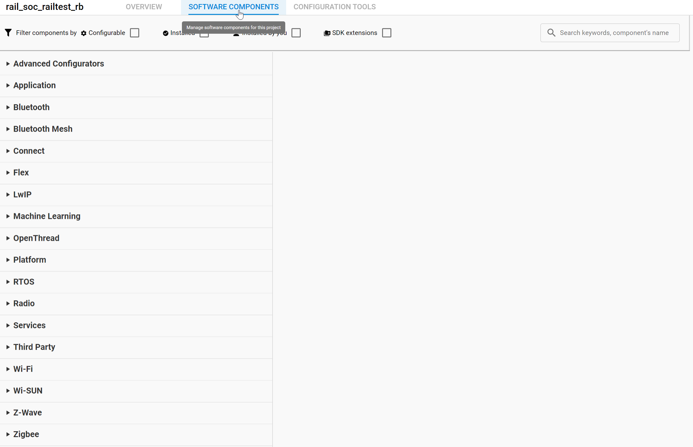
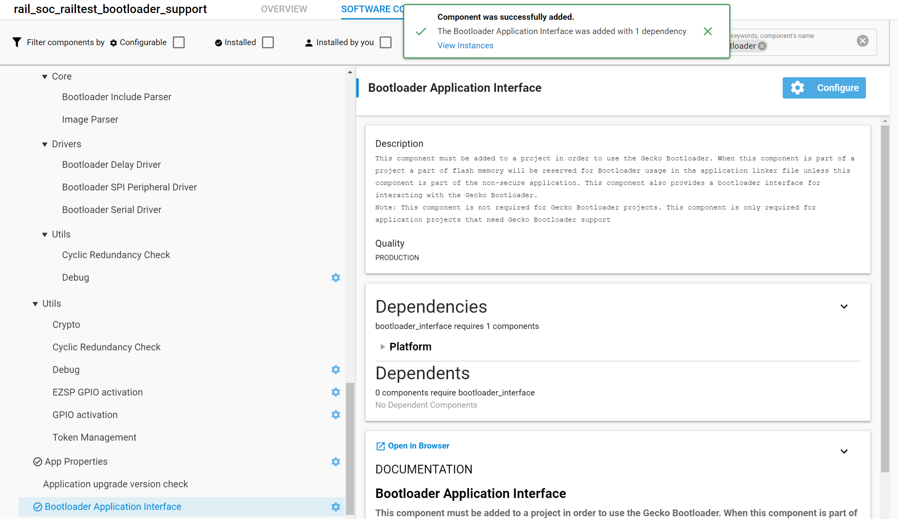

## Modification to add bootloader support

  1.  Select the project file (.slcp)

  2.  go to the Software Components view

   

  3.  add the Bootloader Application Interface component

   

  4. modify your app.c file with this content. It adds a cli command named "bootload" and a call to the bootloader reboot function:

   ```c
   /***************************************************************************//**
   * @file
   * @brief Application-level Functions
   *******************************************************************************
   * # License
   * <b>Copyright 2019 Silicon Laboratories Inc. www.silabs.com</b>
   *******************************************************************************
   *
   * SPDX-License-Identifier: Zlib
   *
   * The licensor of this software is Silicon Laboratories Inc.
   *
   * This software is provided 'as-is', without any express or implied
   * warranty. In no event will the authors be held liable for any damages
   * arising from the use of this software.
   *
   * Permission is granted to anyone to use this software for any purpose,
   * including commercial applications, and to alter it and redistribute it
   * freely, subject to the following restrictions:
   *
   * 1. The origin of this software must not be misrepresented; you must not
   *    claim that you wrote the original software. If you use this software
   *    in a product, an acknowledgment in the product documentation would be
   *    appreciated but is not required.
   * 2. Altered source versions must be plainly marked as such, and must not be
   *    misrepresented as being the original software.
   * 3. This notice may not be removed or altered from any source distribution.
   *
   ******************************************************************************/
  #include "app.h"
  #include "sl_cli.h"
  #include "sl_cli_config.h"
  #include "sl_cli_command.h"
  #include "sl_cli_arguments.h"
  #include "btl_interface.h"
  #include "em_msc.h"

  void cliSeparatorHack(sl_cli_command_arg_t *arguments);

  void bootload(sl_cli_command_arg_t *args)
  {
    if((bootloader_init()) == BOOTLOADER_OK)
      bootloader_rebootAndInstall();
  }

  static const sl_cli_command_info_t cli_cmd___________________________ = \
      SL_CLI_COMMAND(cliSeparatorHack,
                   "",
                    "",
                   {SL_CLI_ARG_END, });

  void cliSeparatorHack(sl_cli_command_arg_t *arguments);

  static const sl_cli_command_info_t cli_cmd__bootload = \
    SL_CLI_COMMAND(bootload,
                   "call the standalone bootloader",
                   "",
                   {SL_CLI_ARG_END, });


  // Define the command table

  const sl_cli_command_entry_t cli_custom_command_table[] = {
    { "___________________________", &cli_cmd___________________________, false },
    { "bootload", &cli_cmd__bootload, false },
    { NULL, NULL, false },
  };

  // define a command group that will contain the command table and be added to the existing CLI instance

  // created by the UC editor CLI component

  sl_cli_command_group_t cli_custom_command_group =
  {
    { NULL },
    false,
    cli_custom_command_table
  };

  extern sl_cli_handle_t sl_cli_inst0_handle;

  void app_init(void)
  {
    sl_cli_command_add_command_group(sl_cli_inst0_handle, &cli_custom_command_group);
  }

  void app_process_action(void)
  {
  }
   ```

  

Once you have done all of the above, your project is ready and you can compile and flash it.