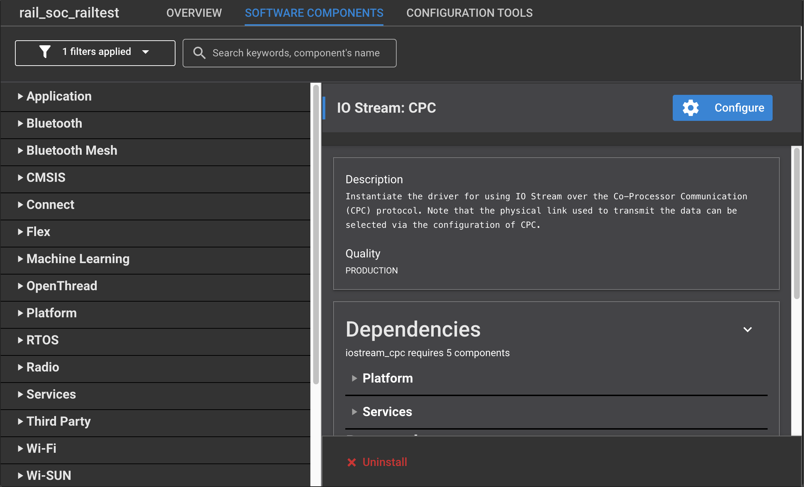
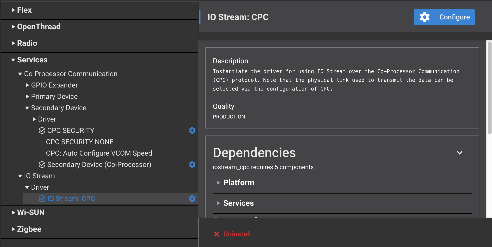
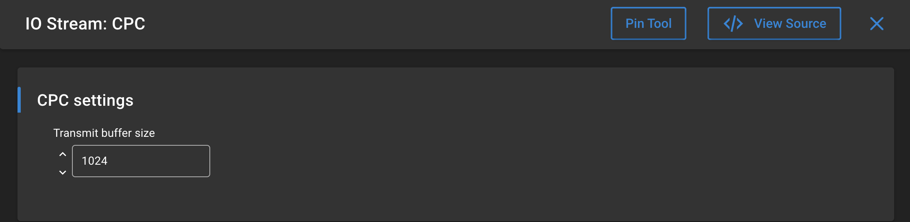

## Modification to replace the UART by CPC interface

1. Select the project file (.slcp)
2. go to the Software Components view



3. install CPC Secondary - UART (USART) or CPC Secondary - SPI (USART) component depending on your CPC interface to the host processor. This will
   automatically install the CPC Core and CPC SECURITY components as well.

   
4. install as well IO Stream: CPC and modify its configuration to increase the transmit buffer size to 1024  at least so that the command responses won't get truncated. Remark that 1024 is not large enough to get the full "help" command response in Railtest application.

   
5. open sl_cli_config_inst0.h in the config directory of your project and modify line 110 as:

```c
   #define SL_CLI_INST0_IOSTREAM_HANDLE    sl_iostream_cpc_handle
```

6. Make a copy of app_common.h located in gecko_sdk_4.4.x\platform\radio\rail_lib\apps\railtest in your project and add the following macros to define USART ports and pins:

* in the case of UART (if your USART instance name is VCOM):

```c
#if defined(SL_CATALOG_CPC_SECONDARY_PRESENT)
  #include "sl_cpc_drv_secondary_uart_usart_vcom_config.h"
  #define VCOM_RX_PORT SL_CPC_DRV_UART_CPC_RX_PORT
  #define VCOM_RX_PIN SL_CPC_DRV_UART_CPC_RX_PIN
  #define VCOM_TX_PORT SL_CPC_DRV_UART_CPC_TX_PORT
  #define VCOM_TX_PIN SL_CPC_DRV_UART_CPC_TX_PIN
#endif
```

* In the case of SPI: (if your USART instance name is EXP)

```c
#if defined(SL_CATALOG_CPC_SECONDARY_PRESENT)
  #include "sl_cpc_drv_secondary_spi_usart_exp_config.h"
  #define VCOM_RX_PORT SL_CPC_DRV_SPI_EXP_RX_PORT
  #define VCOM_RX_PIN SL_CPC_DRV_SPI_EXP_RX_PIN
  #define VCOM_TX_PORT SL_CPC_DRV_SPI_EXP_TX_PORT
  #define VCOM_TX_PIN SL_CPC_DRV_SPI_EXP_TX_PIN
#endif
```


7. Once you have done all of the above, your project is ready and you can compile and flash it.
