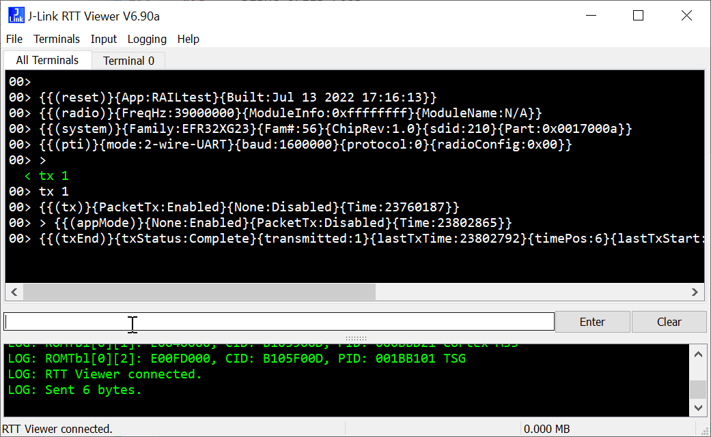

## How to use Railtest with RTT interface

  1.  using Segger RTT viewer:

Using Segger RTT viewer application you will connect the EFR32 using the debugger interface to access the new terminal interface we integrated to Railtest.

then you can type any command and see the received data

  2. using a telnet connection:

you need to have an active debug session to connect the Jlink telnet server. 
To do so, in Simplicity Studio v5, you will need to run the project in debug and run the code.

then connect using a tenet connection on the Jlink IP address (if usb local, 127.0.0.1) and port 19021.