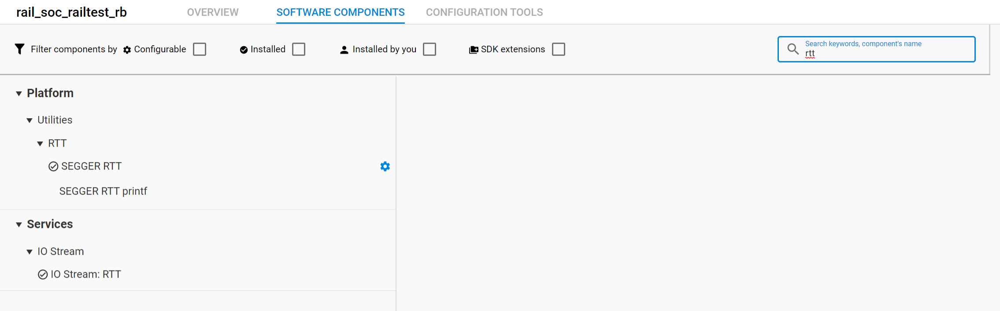

## Modification to replace the UART by RTT interface

  1.  Select the project file (.slcp)

  2.  go to the Software Components view

   

  3.  add the RTT and IOSTREAM: RTT components

   

  4. open sl_cli_config_inst0.h in the config directory of your project and modify line 110 as:

   ```c
   #define SL_CLI_INST0_IOSTREAM_HANDLE    sl_iostream_rtt_handle
   ```

  5. select file trx_ci.c and comment lines 727 to 730 and 789/790 to remove UART wake up feature capability as we have no UART anymore. as you modify a SDK linked file, you will be asked to copy it in the project for the modifications.

  

  
  
  ```c
  //    GPIO_ExtIntConfig(VCOM_RX_PORT,
  //                      VCOM_RX_PIN,
  //                      VCOM_RX_PIN,
  //                      false, true, true);
   ```

  ```c
  //    GPIO_IntDisable(1U << VCOM_RX_PIN);
  //    GPIO_IntClear(1U << VCOM_RX_PIN);
   ```
     

Once you have done all of the above, your project is ready and you can compile and flash it.